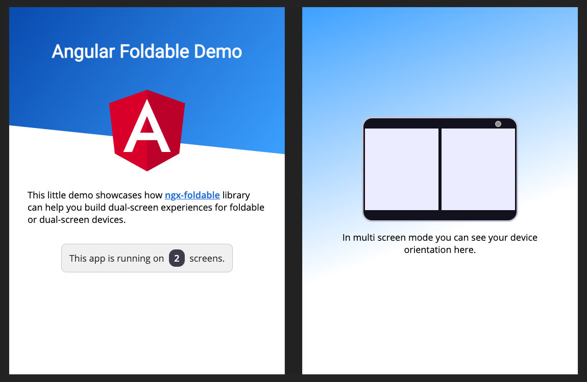

# 📖 ngx-foldable

[](https://www.npmjs.com/package/ngx-foldable)


[](https://github.com/sinedied/ngx-foldable/actions)
[](LICENSE)

> ngx-foldable is a set of components and services to help you build dual-screen experiences for foldable or dual-screen devices, such as the [Surface Duo](https://docs.microsoft.com/dual-screen/web/?WT.mc_id=javascript-9776-yolasors)

<p align="center">
  
<p>

See the [live demo](https://sinedied.github.io/ngx-foldable/demo/) or read the [full documentation](https://sinedied.github.io/ngx-foldable/).

## How to test on your browser

The dual-screen emulation feature requires latest Microsoft Edge or Google Chrome versions (>= 97).

If you have older browser versions, you need to enable experimental flags.
Follow [the instructions here](https://devblogs.microsoft.com/surface-duo/build-and-test-dual-screen-web-apps/?WT.mc_id=javascript-9776-yolasors#build-and-test-on-the-desktop) to setup your browser for dual-screen emulation.

## Library usage

Check out the [demo](./projects/demo/src/app) source code to see an example usage of the library.

Add the library to your Angular project:

```sh
npm install ngx-foldable
```

Import the library in your app:

```ts
import { FoldableModule } from 'ngx-foldable';
...

@NgModule({
  ...
  imports: [
    FoldableModule
    ...
  ],
  ...
})
export class AppModule { }
```

Use the provided `fdSplitLayout`, `fdWindow` and `fdIfSpan` directives to build your layout:

```html
<!--
  SplitLayout supports: flex, grid or absolute
  Styling is only added when a multi screen mode is detected.
-->
<div fdSplitLayout="grid">

  <!-- Assign to first window segment -->
  <section fdWindow="0">
    This will be displayed on the first window segment of a multi screen or single screen device.
    
    <p *fdIfSpan="'none'; else alt">This is only visible on a single screen device.</p>
    <ng-template #alt><p>This is only visible on a multi screen device.</p></ng-template>
  </section>

  <!-- Assign to second window segment -->
  <section fdWindow="1">
    This will be displayed on the second window segment of a multi screen device.

    <p *fdIfSpan="'multi'">This is only visible on multi screen device, regardless of the orientation.</p>
    <p *fdIfSpan="'dual-vertical'">This is only visible on dual vertical viewports.</p>
    <p *fdIfSpan="'dual-horizontal'">This is only visible on dual horizontal viewports.</p>
  </section>
</div>
```

Using the `ScreenContext` service, you can also receive updates when the screen context changes:

```typescript
import { ScreenContext } from 'ngx-foldable';
...
export class AppComponent {
  constructor(private screenContext: ScreenContext) {
    this.screenContext
      .asObservable()
      .subscribe((context) => {
        console.log('Screen context changed:', context);
      });
  }
}
```

You can read the full documentation [here](https://sinedied.github.io/ngx-foldable/).

## Contributing

You're welcome to contribute to this project!
Make sure you have read the [code of conduct](./CODE_OF_CONDUCT) before posting an issue or a pull request.

Follow these steps to run this project locally:

1. Clone the repository on your machine
2. Run `npm install` to install packages
3. Run `npm start` to start the dev server with the demo app

You can then start making modifications on the library or demo app code.

## Related work

- [Surface Duo Photo Gallery](https://github.com/sinedied/surface-duo-photo-gallery): Angular re-implementation of the [Surface Duo Photo Gallery sample](https://github.com/foldable-devices/demos/tree/master/photo-gallery) using this library
- [react-foldable](https://github.com/aaronpowell/react-foldable): a similar library built for React
- [foldable-devices/demos](https://github.com/foldable-devices/demos): web demos for foldables devices.
